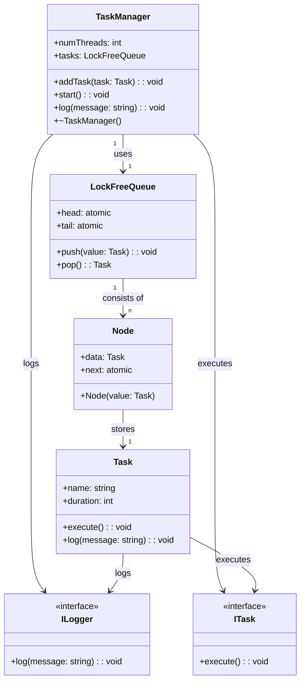

# Thread Pool Project

## Overview

This project implements a thread pool using C++17, providing task management and logging functionality. It includes a `TaskManager` to manage multiple tasks and a `Task` class to represent individual units of work. The project is designed to demonstrate multithreading concepts and can be extended for real-world applications.

---

## Features

- **Thread Pool**: Efficiently manage a fixed number of threads to execute tasks concurrently.
- **Task Management**: Add tasks dynamically, each with a unique name and duration.
- **Logging**: Track task execution with detailed logs.
- **Unit Testing**: Comprehensive tests using Google Test (GTest).

---

## Installation and Usage

### Prerequisites
- C++17 or later
- CMake (version 3.10 or later)
- Google Test

### Building the Project
1. Clone the repository:
   ```bash
   git clone https://github.com/ValentinMorel/thread-pool.git
   cd thread-pool
   ```

2. Build the project using the Makefile
  ```bash
  make 
  ```

3. Run the main executable after building
  ```bash
  make run
  ```

4. Run the tests using Google Test:
  ```bash
  make test 
  ```


### Google Test Output 

```bash
Test project /home/user/Documents/thread-pool/build
    Start 1: TaskManagerTests
1/1 Test #1: TaskManagerTests .................   Passed    4.01 sec

100% tests passed, 0 tests failed out of 1

Total Test time (real) =   4.02 sec
```

## High level design




## Future Work
- Add task prioritization.
- Implement dynamic thread pool resizing.
- Provide a GUI for monitoring task execution.
